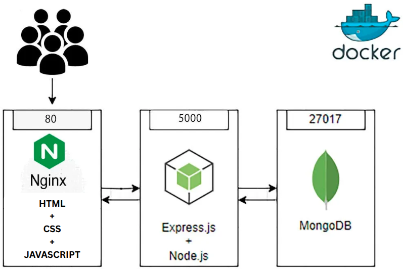

# Secure 3-Tier DevOps To-Do Stack

This project is a production-ready To-Do application built to demonstrate shift-left container orchestration. I implemented Google Distroless runtimes, non-root execution, and strict network segmentation.

---



## Tech Stack

| Component | Technology | Role |
| :--- | :--- | :--- |
| **Frontend** | Nginx + HTML, CSS & JS | Reverse Proxy & Static File Serving |
| **Backend** | Node.js 20 | REST API |
| **Database** | Binami-Hardened MongoDB | Persistent Data Store |
| **Infrastructure** | Terraform | Infrastructure as Code (IaC) |
| **Cloud Provider** | AWS (VPC, EC2, ALB, S3) | Cloud Hosting & Networking |
| **CI/CD** | GitHub Actions | Automated Pipelines (Build, Test & Deploy) |
| **Runtime** | Docker Compose | Container Orchestration |
| **Image Registry** | Docker Hub | Container Image Management |
| **Security Scanning** | Trivy & Gitleaks | Vulnerability & Secret Scanning |
| **Base OS** | Ubuntu (EC2) / Distroless | Host and Container Runtimes |

---

## Key Security Features

### 1. Multi-Stage Builds & Distroless Images
The backend utilizes a **Multi-Stage Docker build** to separate the build environment from the runtime. 
* The final production image is built on **Google Distroless**.
* **Why?** It contains zero shell access (`sh`, `bash`), no package managers (`npm`, `apk`), and no unnecessary binaries, making it nearly impossible for an attacker to perform lateral movement.

### 2. Non-Root Execution (Principle of Least Privilege)
Standard containers often run as `root`, which is a major security risk. 
* **Backend:** Explicitly configured to run as `USER 1000`.
* **Database:** Utilizes a hardened **Bitnami** image, pre-configured to run as a non-privileged user.
* **Benefit:** Even in the event of a container breakout, the attacker lacks root privileges on the host machine.

### 3. Network Segmentation (Dual-Bridge Isolation)
Instead of a single flat network, this project implements **Network Segmentation** via two distinct Docker bridges:
* **`frontend-nw`**: Connects Nginx (Gateway) to the Node.js Backend.
* **`backend-nw`**: Connects the Node.js Backend to the Database.
* **The Result:** The Database is physically isolated from the Frontend. A breach at the web layer does not provide a direct path to the data layer.

### 4. Immutable Image Pinning
To ensure **Deterministic Builds** and protect against supply-chain attacks, the MongoDB image is pinned using its unique **SHA256 Content Addressable Identifier (Digest)**. This guarantees the image used in production is exactly the one that was verified.

### 5. Container Resource Constraints
To prevent noisy-neighbor problems and safeguard against Out-Of-Memory (OOM) cascading failures, all deployments within `docker-compose.yaml` (Frontend, Backend, and Database) are explicitly constrained with defined CPU bounds (e.g., `cpus: '0.5'`) and memory limits.

---

## Observability & API Endpoints

The stack includes custom health probes designed for DevOps monitoring tools:
* `/api/health`: Provides application heartbeat and uptime status.
* `/api/db`: Performs a real-time connection handshake with the MongoDB instance.
* **Monitoring UI:** Dedicated pages located at `/status/health` and `/status/db` allow for manual verification of system status.

### Core Application API
* `GET /api/todos`: Fetches the current list of To-Do items.
* `POST /api/todos`: Creates a new To-Do task.

---

## How to Run Locally

### Prerequisites
* Docker & Docker Compose installed.

### Steps
1. **Clone the repository:**
    ```bash
    git clone https://github.com/ebad-arshad/codechine-project.git
    cd codechine-project
    ```

2. **Set Environment Variables:**
   You can either export them to your shell or create a `.env` file (see `.env.example` for required keys):
    ```bash
    export MONGODB_ROOT_PASSWORD='your_password'
    export MONGODB_PASSWORD='your_password'
    ```

3. **Start the services:**
    ```bash
    docker compose up --build
    ```

4. **Access Endpoints:**
- Application: http://localhost:80
- Health Page: http://localhost:80/status/health
- DB Status Page: http://localhost:80/status/db

---

## Infrastructure as Code (IaC)
The project utilizes a modular, multi-environment Terraform architecture to provision a highly secure and segmented 3-tier VPC on AWS.

### VPC Design
The infrastructure is built on a custom VPC designed for maximum isolation:
- Public Layer: 2 Public Subnets housing the Application Load Balancer (ALB) and the NAT Gateway.
- Private Layer: 3 dedicated Private Subnets isolating the Frontend, Backend, and Database layers.
- Connectivity: 
- Internet Gateway (IGW): Provides entry for public traffic to the ALB.
- NAT Gateway + EIP: Allows Backend and Database instances in private subnets to pull images from the internet securely without being exposed to inbound threats.
- Route Tables: Strictly defined public and private routing logic to maintain traffic boundaries.

### Multi-Tier Security Groups
Traffic is governed by the principle of Least Privilege using a chained Security Group (SG) architecture:
- ALB SG: Allows inbound traffic on Port 80.
- Frontend SG: Allows traffic only on Port 80 from the ALB SG.
- Backend SG: Allows traffic only on Port 5000 from the Frontend SG.
- Database SG: Allows traffic only on Port 27017 from the Backend SG.

### Automated Provisioning & Orchestration
- Compute: 3 EC2 instances (Frontend, Backend, Database) distributed across private subnets.
- User Data Scripts: Terraform injects environment specific shell scripts (found in terraform/modules/instance/scripts/) into the EC2 launch configuration.
- Load Balancing: The ALB acts as the single point of entry, routing traffic only to the Frontend tier.

### State Management
The project utilizes the latest Terraform features for enterprise-grade state reliability:
- S3 Remote Backend: Centralizes the state file for team collaboration and pipeline synchronization.
- Native S3 Locking: Utilizing S3's native locking capabilities instead of requiring an external DynamoDB table.

### Modular Directory Structure:
  ```bash
    terraform
    ├── environments/dev  # Environment specific configurations
    └── modules           # Reusable components (VPC, ALB, Security, Instances)
  ```

---

## Continuous Integration and Quality Assurance

The project implements a modular CI/CD strategy using GitHub Actions. By utilizing path-based triggers, the pipeline ensures that only the affected services are rebuilt and scanned, optimizing the feedback loop for development.

### Modular Workflows
- **[`frontend-ci.yml`](.github/workflows/frontend-ci.yml)**: Triggers on frontend changes; builds Nginx image and runs security scans.
- **[`backend-ci.yml`](.github/workflows/backend-ci.yml)**: Triggers on backend changes; performs Node.js build, including Trivy analysis and Gitleaks scanning.
- **[`docker-compose-test.yml`](.github/workflows/docker-compose-test.yml)**: Bootstraps the stack locally via GitHub runner for integration and handshake testing.
- **[`terraform-cd.yml`](.github/workflows/terraform-cd.yml)**: Automates AWS infrastructure provisioning and updates.

### Security Gates and Static Analysis
- Secret Scanning: Gitleaks is integrated into the workflow to scan the repository for accidentally committed credentials, private keys, or sensitive strings.
- Filesystem Analysis: Trivy performs a static analysis (FS scan) on the source code prior to the build phase to identify misconfigurations in the Dockerfiles and application structure.
- Container Hardening Verification: Post-build, the final images are subjected to a Trivy vulnerability scan. The pipeline is configured to fail if any High or Critical vulnerabilities are detected, ensuring that only hardened images reach the registry.

### Orchestration Validation
In parallel with the service builds, a dedicated Integration Test workflow validates the entire stack. This workflow:
- Performs a configuration check on the docker-compose.yaml to catch syntax or logic errors.
- Provisions the full environment (Frontend, Backend, and Database) on a clean GitHub runner.
- Executes automated handshake tests to verify that the Backend can successfully persist data to MongoDB and that the Nginx proxy is correctly routing traffic to the internal API endpoints.

---

## Continuous Deployment
The project features a modular CD pipeline designed to bridge the gap between application artifacts and cloud infrastructure.

### The Workflow Handshake
- Automated Trigger: On a successful master push, the Docker CI workflow builds images and triggers the Infrastructure CD via GitHub API.
- Separation of Concerns: This handshake ensures infrastructure is only updated after application images are verified and pushed to the registry.

### Deployment Control
- Manual Gates: While app updates are automated, architectural changes (VPC, Security Groups) are triggered manually via Workflow Dispatch for human-in-the-loop review.
- Cost Management: Includes a manual destroy action to ensure 100% cleanup of AWS resources when the environment is not in use.

---

## CI/CD Pipeline Configuration

### Prerequisites

### AWS Infrastructure
* AWS CLI, Terraform installed.
* An S3 Bucket: This must exist before you run the pipeline. It stores your terraform.tfstate.
* IAM User

### GitHub Secrets
Navigate to Settings > Secrets and variables > Actions and add the following Secrets:
| Secret Name | Description |
| :--- | :--- |
| AWS_ACCESS_KEY_ID | Your IAM User's Access Key. |
| AWS_SECRET_ACCESS_KEY | Your IAM User's Secret Key. |
| DOCKERHUB_TOKEN | Your Docker Hub Personal Access Token (PAT). |
| MONGODB_PASSWORD | The password for the application database. |
| MONGODB_ROOT_PASSWORD | The root password for MongoDB initialization. |

### GitHub Variables

Add these under the Variables tab:
| Variable Name | Description |
| :--- | :--- |
| DOCKERHUB_USERNAME | Your Docker Hub username. |
| TERRAFORM_WORKSPACE | Set to dev (matching your environments/dev folder). |

## Guide to Run via CI/CD 
### Step 1: Initialize the Remote Backend
  ```bash
    terraform {
        required_providers {
            aws = {
            source  = "hashicorp/aws"
            version = "6.33.0"
            }
        }
        backend "s3" {
            bucket       = "your-unique-state-bucket-name"
            key          = "terraform.tfstate"
            region       = "ap-south-1"
            use_lockfile = true
            encrypt      = true
        }
    }
  ```

### Step 2: Push to Master
  ```bash
    git add .
    git commit -m "your commit"
    git push origin master
  ```

### Step 3: ALB DNS Name
Once the Infrastructure CD finishes, check the logs of the Terraform Apply step:
- Copy the ALB DNS Name from the output at the end of the GitHub Action log.
- Paste it into your browser. Traffic will flow:
    ```bash 
    Internet -> Load Balancer -> Frontend -> Backend -> Database
    ```

### Manual Cleanup
- Go to the Actions tab in GitHub.
- Select the Infrastructure CD workflow.
- Click Run workflow.
- Type destroy in the action input.


---

**Project maintained by:** **[Muhammad Ebad Arshad](https://github.com/ebad-arshad)** > [](https://www.linkedin.com/in/ebad-arshad)